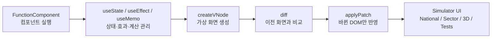
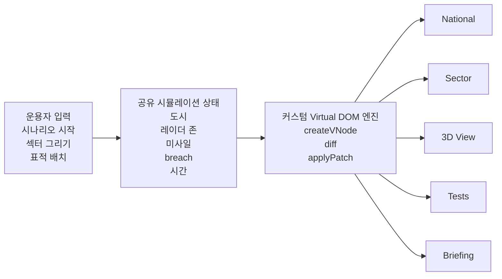
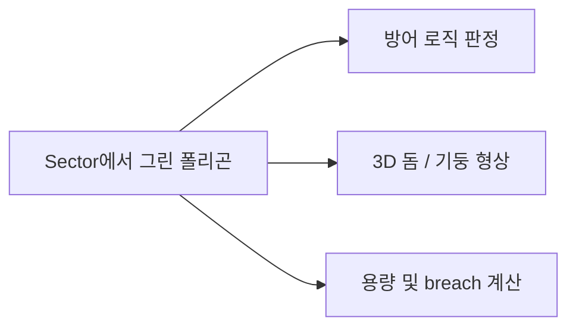

# Iron Dome Defense Simulator

'아이언돔 방공 시뮬레이터'

**바닐라 자바스크립트**로 직접 만든 **커스텀 Virtual DOM 엔진**이, 이렇게 **복잡하고 무거운 상태(State) 기반 인터페이스를 완벽하게 감당**할 수 있다.

## 왜 이 프로젝트가 과제에 맞는가

### 1. 커스텀 렌더러가 실제 화면을 움직입니다

`FunctionComponent`, `useState`, `useEffect`, `useMemo`, `createVNode`, `diff`, `applyPatch`를 직접 구현했고, 그 흐름이 그대로 시뮬레이터 UI를 구동합니다.



| 구현 요소 | 매우 짧은 역할 |
|-----------|----------------|
| `FunctionComponent` | 함수 컴포넌트를 실행하고 hook 순서를 유지 |
| `useState` | 상태 저장과 리렌더 트리거 |
| `useEffect` | 이벤트, 루프, 리스너 같은 부수효과 연결 |
| `useMemo` | 무거운 계산 결과 재사용 |
| `createVNode` | 가상 화면 구조 생성 |
| `diff` | 이전 화면과 새 화면 비교 |
| `applyPatch` | 바뀐 부분만 실제 DOM에 반영 |

### 2. 하나의 도형 데이터가 여러 역할을 수행합니다

섹터 화면에서 그린 폴리곤은 화면에만 그려지는 것이 아니라, 방어 판정 로직과 3D 방어 형상까지 동시에 결정합니다.

### 3. 모든 화면이 하나의 상태를 공유합니다

National, Sector, 3D View, Tests, Briefing은 따로 노는 페이지가 아니라 같은 시뮬레이션 상태를 서로 다른 관점으로 보여줍니다.

## 시스템 구조



## 도형 재사용 구조



## 구현 포인트

- **Virtual DOM**: `createVNode`, `renderVNode`, `diff`, `applyPatch`
- **Component 구조**: 루트 `App` 중심 상태 관리, 하위 뷰는 props 기반 렌더링
- **Hooks 직접 구현**: `useState`, `useEffect`, `useMemo`
- **단일 데이터 재사용**: 동일한 섹터 폴리곤이 입력, 방어 로직, 3D 형상에 재사용
- **복합 뷰 동기화**: National / Sector / 3D / Tests / Briefing이 하나의 시뮬레이션 흐름을 공유

```

## 핵심 메시지

> 이 프로젝트의 포인트는 “시뮬레이터를 만들었다”가 아니라,
> **직접 구현한 Virtual DOM 아키텍처가 복잡한 인터페이스와 시뮬레이션 상태를 실제로 감당할 수 있음을 입증했다**는 점입니다.
