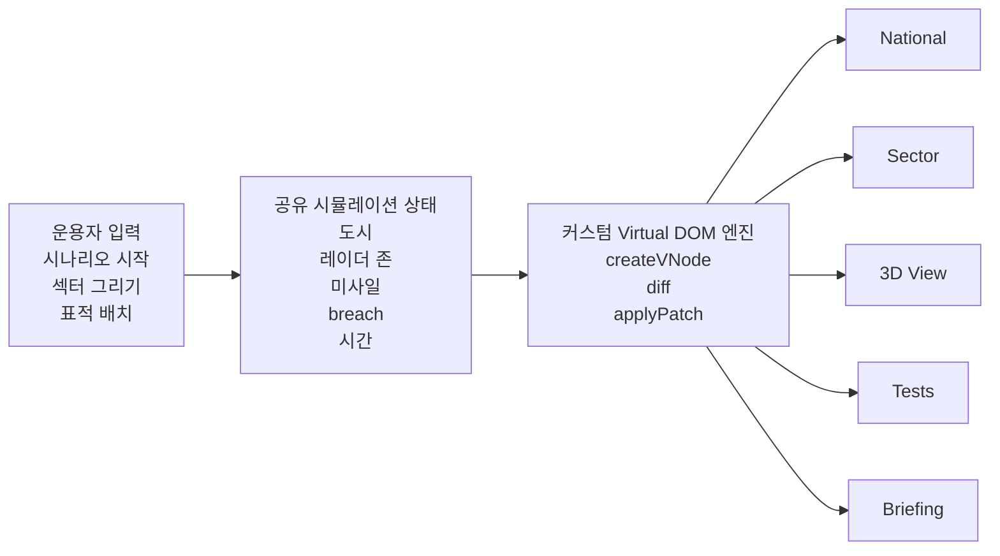
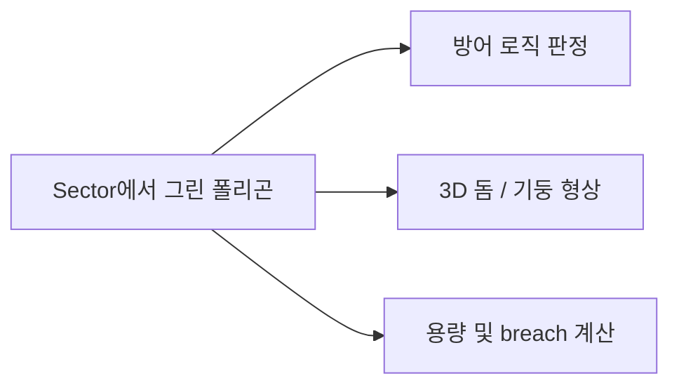

# Iron Dome Defense Simulator

Vanilla JavaScript로 직접 구현한 **커스텀 Virtual DOM 엔진** 위에, 국가 단위 방공 상황과 도시 단위 방어 시뮬레이션을 올린 프로젝트입니다. 이 프로젝트는 단순한 미사일 데모가 아니라, **직접 만든 렌더링 엔진이 복잡한 상태 기반 인터페이스를 실제로 구동할 수 있음을 보여줍니다.**

## 왜 이 프로젝트가 과제에 맞는가

1. **커스텀 렌더러가 핵심입니다.**
   `createVNode`, `diff`, `applyPatch`, `FunctionComponent`, `useState`, `useEffect`, `useMemo`를 직접 구현했고, 그 결과물이 실제 시뮬레이터 UI를 구동합니다.

2. **하나의 도형 데이터가 여러 역할을 수행합니다.**
   섹터 화면에서 그린 폴리곤은 화면에만 그려지는 것이 아니라, 방어 판정 로직과 3D 방어 형상까지 동시에 결정합니다.

3. **모든 화면이 하나의 상태를 공유합니다.**
   National, Sector, 3D View, Tests, Briefing은 따로 노는 페이지가 아니라 같은 시뮬레이션 상태를 서로 다른 관점으로 보여줍니다.

## 시스템 구조

## 도형 재사용 구조

## 발표에서 보여줄 흐름

| 단계 | 화면 | 보여줄 핵심 |
|------|------|-------------|
| 1 | `National` | 국가 단위 위협 감시와 다중 도시 상황 인식 |
| 2 | `Sector` | 운용자가 직접 방어 구역을 그리는 입력 단계 |
| 3 | `3D View` | 같은 데이터가 실제 방어 볼륨으로 재구성되는 시각화 |
| 4 | `Tests` | 엔진이 최소 DOM 갱신과 상태 복원을 수행한다는 검증 |
| 5 | `Briefing` | 이 프로젝트가 과제와 어떻게 연결되는지 구조적으로 설명 |

## 구현 포인트

- **Virtual DOM**: `createVNode`, `renderVNode`, `diff`, `applyPatch`
- **Component 구조**: 루트 `App` 중심 상태 관리, 하위 뷰는 props 기반 렌더링
- **Hooks 직접 구현**: `useState`, `useEffect`, `useMemo`
- **단일 데이터 재사용**: 동일한 섹터 폴리곤이 입력, 방어 로직, 3D 형상에 재사용
- **복합 뷰 동기화**: National / Sector / 3D / Tests / Briefing이 하나의 시뮬레이션 흐름을 공유

## 핵심 메시지

> 이 프로젝트의 포인트는 “시뮬레이터를 만들었다”가 아니라,
> **직접 구현한 Virtual DOM 아키텍처가 복잡한 인터페이스와 시뮬레이션 상태를 실제로 감당할 수 있음을 입증했다**는 점입니다.
